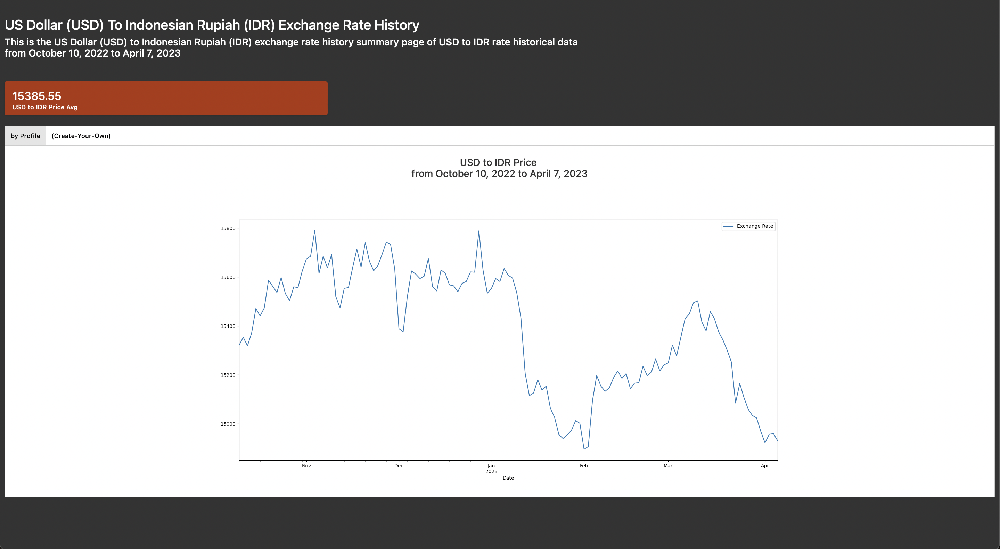

# Web-Scrapping using Beautifulsoup

This project was developed as one of the pinnacle projects of the Algoritma Academy Data Analysis Specialization. The expected deliverable of this project is to do a simple web scraping to get information. We'll also be using a simple pumpkin dashboard to display our memo and visualization results.

## Dependencies

- beautifulSoup4
- pandas
- flask
- matplotlib

You can install the dependencies

```python
pip install -r requirements.txt
```

In this Capstone Project, I choose the problem from 

- Exchange Rate USD in IDR Price `https://www.exchange-rates.org/history/IDR/USD/T`
    * From that page search for `daily price`, and `date`
    * Make a plot of the movement of the USD exchange rate

## Flask Dashboard

This project also expects output in the form of a flask dashboard from the dataframe that has been taken from the web scrapping process. You can open the `app.py` to see the process of develop the flask dashboard.

The code is similiar to scrapping the web. But the difference is, 

```python
@app.route("/")
def index(): 
	
	card_data = f'{df["Exchange Rate"].mean().round(2)}' #be careful with the " and ' 

	# generate plot
	ax = df.plot(figsize = (20,9)) 
	
	# Rendering plot
	figfile = BytesIO()
	plt.savefig(figfile, format='png', transparent=True)
	figfile.seek(0)
	figdata_png = base64.b64encode(figfile.getvalue())
	plot_result = str(figdata_png)[2:-1]
   
   # render to html
	return render_template('index.html',
		card_data = card_data, 
		plot_result=plot_result
		)
```   
there is another insight that I made which is the average value from Exchange Rate data.

Here is the result of my Flask Dashboard

<p align="center">
  
</p>
